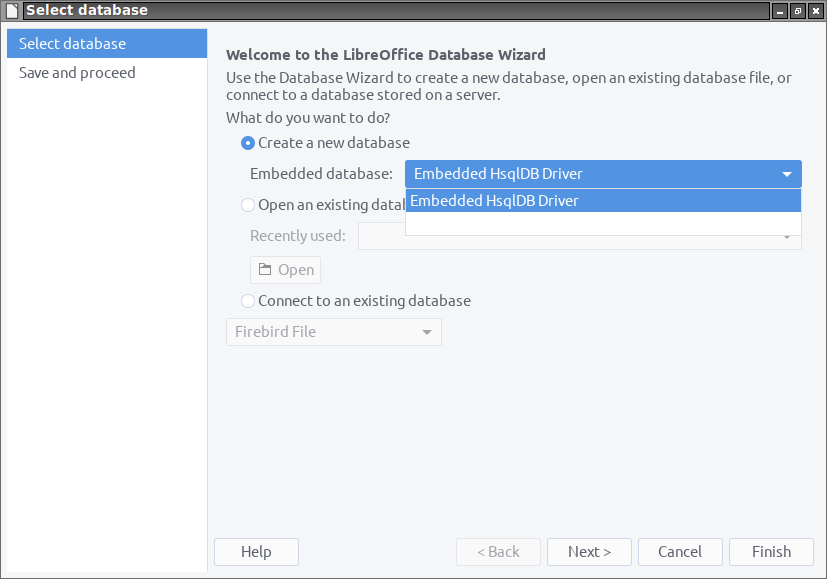

**This [document](https://prrvchr.github.io/HsqlDBembeddedOOo) in English.**

**L'utilisation de ce logiciel vous soumet à nos** [**Conditions d'utilisation**](https://prrvchr.github.io/HsqlDBembeddedOOo/HsqlDBembeddedOOo/registration/TermsOfUse_fr)

# version [0.0.2](https://prrvchr.github.io/HsqlDBembeddedOOo/README_fr#historique)

## Introduction:

**HsqlDBembeddedOOo** fait partie d'une [Suite](https://prrvchr.github.io/README_fr) d'extensions [LibreOffice](https://fr.libreoffice.org/download/telecharger-libreoffice/) et/ou [OpenOffice](https://www.openoffice.org/fr/Telecharger/) permettant de vous offrir des services inovants dans ces suites bureautique.  
Cette extension vous donne accès à la base de données HsqlDB intégrée tout en pouvant profiter d'un pilote HsqlDB avancé.

Etant un logiciel libre je vous encourage:
- A dupliquer son [code source](https://github.com/prrvchr/HsqlDBembeddedOOo/).
- A apporter des modifications, des corrections, des améliorations.
- D'ouvrir un [disfonctionnement](https://github.com/prrvchr/HsqlDBembeddedOOo/issues/new) si nécessaire.

Bref, à participer au developpement de cette extension.  
Car c'est ensemble que nous pouvons rendre le Logiciel Libre plus intelligent.

## Prérequis:

[HsqlDB](http://hsqldb.org/) est une base de données écrite en Java.  
L'utilisation de HsqlDB nécessite l'installation et la configuration dans LibreOffice / OpenOffice d'un **JRE version 1.8 minimum** (c'est-à-dire: Java version 8)

Parfois, il peut être nécessaire pour les utilisateurs de LibreOffice de ne pas avoir de pilote HsqlDB installé avec LibreOffice  
(vérifiez vos applications installées sous Windows ou votre gestionnaire de paquets sous Linux)  
~~Il semble que les versions 6.4.x et 7.x de LibreOffice aient résolu ce problème et sont capables de fonctionner simultanément avec différentes versions de pilote de HsqlDB.~~  
Après de nombreux tests, il semble que LibreOffice (6.4.x et 7.x) ne puisse pas charger un pilote HsqlDB fourni (hsqldb.jar v2.5.1), si le pilote HsqlDB intégré est installé (et même la solution est parfois de renommer le fichier hsqldb.jar dans /usr/share/java, la désinstallation du paquet libreoffice-sdbc-hsqldb ne semble pas suffisante...)  
Pour surmonter cette limitation et si vous souhaitez utiliser HsqlDB intégré, supprimez le pilote HsqlDB intégré (hsqldb.jar v1.8.0) et installez cette extension: [HsqlDBembeddedOOo](https://prrvchr.github.io/HsqlDBembeddedOOo/README_fr) pour remplacer le pilote HsqlDB intégré disfonctionnant de LibreOffice.  
OpenOffice ne semble pas avoir besoin de cette solution de contournement.

## Installation:

Il semble important que le fichier n'ait pas été renommé lors de son téléchargement.  
Si nécessaire, renommez-le avant de l'installer.

- Installer l'extension [HsqlDBembeddedOOo.oxt](https://github.com/prrvchr/HsqlDBembeddedOOo/raw/master/HsqlDBembeddedOOo.oxt) version 0.0.2.

Redémarrez LibreOffice / OpenOffice après l'installation.

## Utilisation:

Dans LibreOffice / OpenOffice aller à: Fichier -> Nouveau -> Base de données...:

A l'étape: Sélectionner une base de données:
- selectionner: Créer une nouvelle base de données
- Dans: Base de données intégrée: choisir: Pilote HsqlDB intégré
- cliquer sur le bouton: Suivant

A l'étape: Enregistrer et continuer:
- ajuster les paramètres selon vos besoins...
- cliquer sur le bouton: Terminer

Maintenant à vous d'en profiter...

## A été testé avec:

* OpenOffice 4.1.8 x86_64 - Ubuntu 20.04 - LxQt 0.14.1

* LibreOffice 6.4.4.2 (x64) - Windows 7 SP1

Je vous encourage en cas de problème :-(  
de créer un [disfonctionnement](https://github.com/prrvchr/HsqlDBembeddedOOo/issues/new)  
J'essaierai de le résoudre ;-)

## Historique:

### Ce qui a été fait pour la version 0.0.1:

- La rédaction de ce pilote a été facilitée par une [discussion avec Villeroy](https://forum.openoffice.org/en/forum/viewtopic.php?f=13&t=103912), sur le forum OpenOffice, que je tiens à remercier, car la connaissance ne vaut que si elle est partagée...

- Utilisation de l'ancienne version de HsqlDB 1.8.0 (peut être facilement mise à jour).

- Ajout d'une boîte de dialogue permettant de mettre à jour le pilote (hsqldb.jar) dans: Outils -> Options -> Pilotes Base -> Pilote HsqlDB intégré

- Beaucoup d'autres correctifs...

### Ce qui a été fait pour la version 0.0.2:

- Maintenant, le pilote divise automatiquement un odb lorsqu'il est ouvert... Cela rend le pilote rétrocompatible avec le pilote LibreOffice Embedded HsqlDB intégré ;-)

- Beaucoup d'autres correctifs...

### Que reste-t-il à faire pour la version 0.0.2:

- Ajouter de nouvelles langue pour l'internationalisation...

- Tout ce qui est bienvenu...
