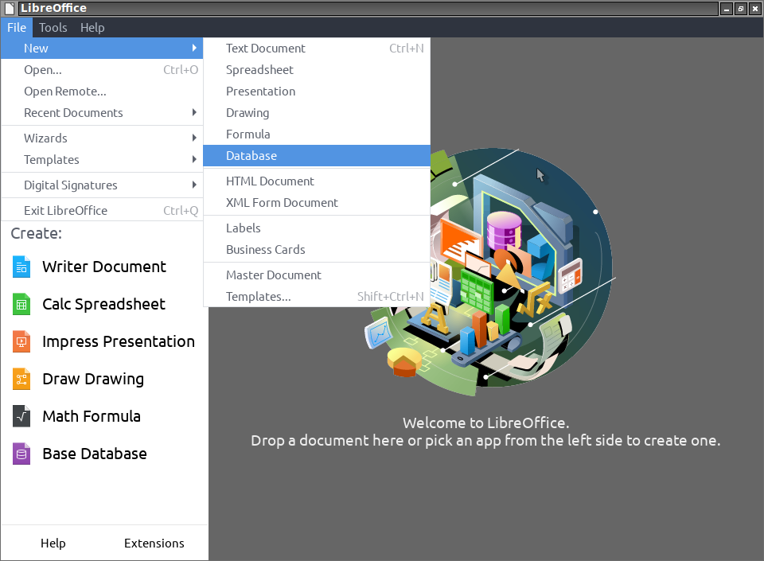
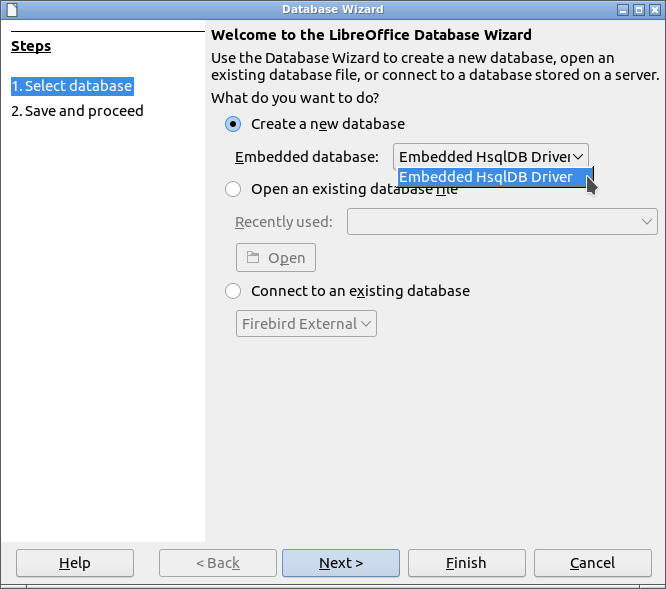
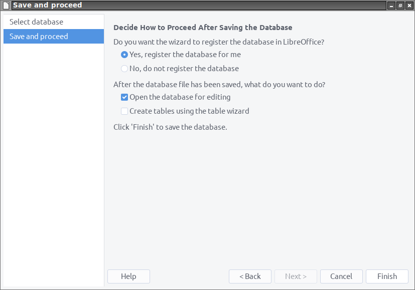

#  HsqlDBembeddedOOo

**This [document](https://prrvchr.github.io/HsqlDBembeddedOOo) in English.**

**L'utilisation de ce logiciel vous soumet à nos** [**Conditions d'utilisation**](https://prrvchr.github.io/HsqlDBembeddedOOo/source/HsqlDBembeddedOOo/registration/TermsOfUse_fr)

# version [0.0.4](https://prrvchr.github.io/HsqlDBembeddedOOo/README_fr#historique)

## Introduction:

**HsqlDBembeddedOOo** fait partie d'une [Suite](https://prrvchr.github.io/README_fr) d'extensions [LibreOffice](https://fr.libreoffice.org/download/telecharger-libreoffice/) et/ou [OpenOffice](https://www.openoffice.org/fr/Telecharger/) permettant de vous offrir des services inovants dans ces suites bureautique.  

Cette extension vous permet:
- De surmonter le [dysfonctionnement 139538](https://bugs.documentfoundation.org/show_bug.cgi?id=139538) pour les utilisateurs de **LibreOffice sur Linux**.
- D'utiliser HsqlDB intégré en mode non compressé (fractionné), qui est plus robuste, avec la version du pilote HsqlDB de votre choix.
- De migrer les données d'une base de données intégrée (fichier odb) vers le pilote HsqlDB complet: [jdbcDriverOOo](https://prrvchr.github.io/jdbcDriverOOo/README_fr), voir: [Comment migrer une base de données intégrée](https://prrvchr.github.io/HsqlDBembeddedOOo/README_fr#comment-migrer-une-base-de-donn%C3%A9es-int%C3%A9gr%C3%A9e).

HsqlDBembeddedOOo ne fonctionne qu'en mode fractionné, avec la possibilité d'extraire (décompresser) les données contenues dans un fichier odb lors de la connexion si un dossier avec le même nom et emplacement que le fichier odb n'existe pas. Cela permet la conversion des fichiers odb produits par le pilote LibreOffice / OpenOffice intégré (Embedded HsqlDB).  
Si ces particularités ne vous concernent pas, alors je vous recommande d'utiliser le pilote [jdbcDriverOOo](https://prrvchr.github.io/jdbcDriverOOo/README_fr) permettant d'exploiter toutes les fonctionnalités offertes par HsqlDB.

Etant un logiciel libre je vous encourage:
- A dupliquer son [code source](https://github.com/prrvchr/HsqlDBembeddedOOo/).
- A apporter des modifications, des corrections, des améliorations.
- D'ouvrir un [dysfonctionnement](https://github.com/prrvchr/HsqlDBembeddedOOo/issues/new) si nécessaire.

Bref, à participer au developpement de cette extension.  
Car c'est ensemble que nous pouvons rendre le Logiciel Libre plus intelligent.

## Prérequis:

[HsqlDB](http://hsqldb.org/) est une base de données écrite en Java.  
son utilisation nécessite [l'installation et la configuration](https://wiki.documentfoundation.org/Documentation/HowTo/Install_the_correct_JRE_-_LibreOffice_on_Windows_10/fr) dans LibreOffice / OpenOffice d'un **JRE version 11 ou ultérieure**.  
Je vous recommande [Adoptium](https://adoptium.net/releases.html?variant=openjdk11) comme source d'installation de Java.

Si vous utilisez **LibreOffice sous Linux**, alors vous êtes sujet au [dysfonctionnement 139538](https://bugs.documentfoundation.org/show_bug.cgi?id=139538).  
Pour contourner le problème, veuillez désinstaller les paquets:
- libreoffice-sdbc-hsqldb
- libhsqldb1.8.0-java

OpenOffice et LibreOffice sous Windows ne sont pas soumis à ce dysfonctionnement.

## Installation:

Il semble important que le fichier n'ait pas été renommé lors de son téléchargement.  
Si nécessaire, renommez-le avant de l'installer.

- Installer l'extension [HsqlDBembeddedOOo.oxt](https://github.com/prrvchr/HsqlDBembeddedOOo/raw/master/source/HsqlDBembeddedOOo/dist/HsqlDBembeddedOOo.oxt) version 0.0.4.

Redémarrez LibreOffice / OpenOffice après l'installation.

## Utilisation:

### Comment créer une nouvelle base de données:

Dans LibreOffice / OpenOffice aller à: Fichier -> Nouveau -> Base de données...:

A l'étape: Sélectionner une base de données:
- selectionner: Créer une nouvelle base de données
- Dans: Base de données intégrée: choisir: Pilote HsqlDB intégré
- cliquer sur le bouton: Suivant

A l'étape: Enregistrer et continuer:
- ajuster les paramètres selon vos besoins...
- cliquer sur le bouton: Terminer

Maintenant à vous d'en profiter...

### Comment migrer une base de données intégrée:

Si vous souhaitez migrer une base de données intégrée (HsqlDB version 1.8.0) vers la dernière version (par exemple 2.5.1), procédez comme suit:
- 1 - Si elle n'est pas déjà installée, installez cette extension.
- 2 - Faite une copie (sauvegarde) de votre base de données (fichier odb).
- 3 - Ouvrir le fichier odb dans Base (double clique sur le fichier odb).
- 4 - Dans Base allez à: Outils -> SQL et tapez la commande SQL: `SHUTDOWN COMPACT` ou `SHUTDOWN SCRIPT`.
- 5 - Changez la version du pilote HsqlDB dans: Outils -> Options -> Pilotes Base -> Pilote HsqlDB intégré, par une version [2.4.0](https://repo1.maven.org/maven2/org/hsqldb/hsqldb/2.4.0/hsqldb-2.4.0.jar) ou [2.4.1](https://repo1.maven.org/maven2/org/hsqldb/hsqldb/2.4.1/hsqldb-2.4.1.jar) ou [2.5.0](https://repo1.maven.org/maven2/org/hsqldb/hsqldb/2.5.0/hsqldb-2.5.0.jar) (Vous devez renommer le fichier jar en hsqldb.jar pour qu'il soit pris en compte).
- 6 - Redémarrer LibreOffice / OpenOffice aprés le changement du pilote (hsqldb.jar).
- Recommencez cette procedure à l'étape 3 en utilisant la version [2.5.1](https://repo1.maven.org/maven2/org/hsqldb/hsqldb/2.5.1/hsqldb-2.5.1.jar).
- Pour finir, répétez l'étape 3 puis 4.

Maintenant vous pouvez utiliser la version complète du pilote [jdbcDriverOOo](https://prrvchr.github.io/jdbcDriverOOo/README_fr), votre base de données est dans un dossier avec le même nom et emplacement que votre fichier odb.

## A été testé avec:

* OpenOffice 4.1.8 - Ubuntu 20.04 - LxQt 0.14.1

* OpenOffice 4.1.8 - Windows 7 SP1

* LibreOffice 7.0.4.2 - Ubuntu 20.04 - LxQt 0.14.1

* LibreOffice 6.4.4.2 - Windows 7 SP1

Je vous encourage en cas de problème :-(  
de créer un [dysfonctionnement](https://github.com/prrvchr/HsqlDBembeddedOOo/issues/new)  
J'essaierai de le résoudre ;-)

## Historique:

### Ce qui a été fait pour la version 0.0.1:

- La rédaction de ce pilote a été facilitée par une [discussion avec Villeroy](https://forum.openoffice.org/en/forum/viewtopic.php?f=13&t=103912), sur le forum OpenOffice, que je tiens à remercier, car la connaissance ne vaut que si elle est partagée...

- Utilisation de l'ancienne version de HsqlDB 1.8.0 (peut être facilement mise à jour).

- Ajout d'une boîte de dialogue permettant de mettre à jour le pilote (hsqldb.jar) dans: Outils -> Options -> Pilotes Base -> Pilote HsqlDB intégré

- Beaucoup d'autres correctifs...

### Ce qui a été fait pour la version 0.0.2:

- Maintenant, le pilote divise automatiquement un odb lorsqu'il est ouvert... Cela permet la conversion des fichiers odb produits par le pilote LibreOffice / OpenOffice HsqlDB intégré ;-)

- Beaucoup d'autres correctifs...

### Ce qui a été fait pour la version 0.0.3:

- Je tiens particulièrement à remercier fredt à [hsqldb.org](http://hsqldb.org/) pour:

    - Son accueil pour ce projet et sa permission d'utiliser le logo HsqlDB dans l'extension.

    - La qualité de sa base de données HsqlDB.

- Fonctionne désormais avec OpenOffice sous Windows.

- Lors de la décompression, un conflit de nom de fichier affiche désormais une erreur précise.

- Gère désormais correctement les espaces dans les noms de fichiers et les chemins.

- Beaucoup d'autres correctifs...

### Ce qui a été fait pour la version 0.0.4:

- Modification de [Driver.py](https://github.com/prrvchr/HsqlDBembeddedOOo/blob/master/source/HsqlDBembeddedOOo/Driver.py) afin de rendre possible l'utilisation du service Uno: `com.sun.star.sdb.RowSet`.

- Beaucoup d'autres correctifs...

### Que reste-t-il à faire pour la version 0.0.4:

- Ajouter de nouvelles langue pour l'internationalisation...

- Tout ce qui est bienvenu...
